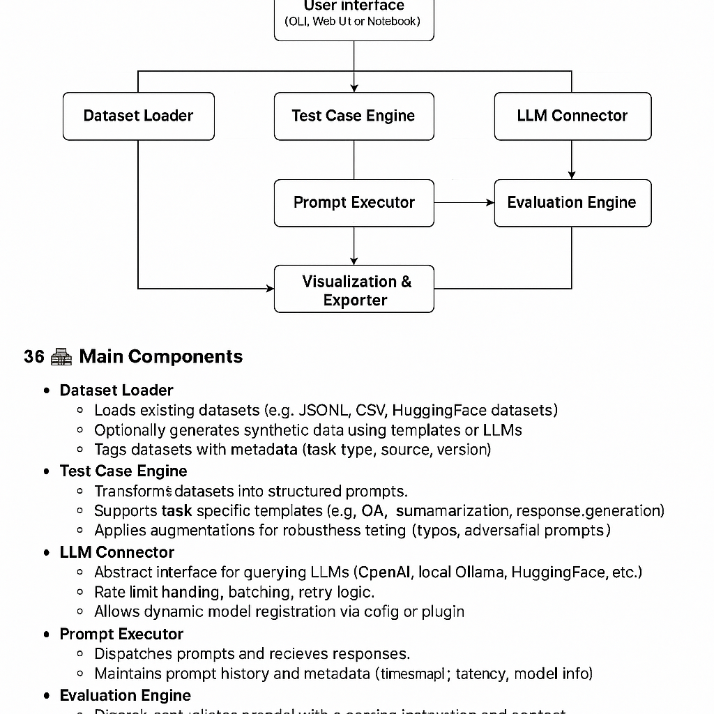

# LLM Benchmarking System

This repository contains the design and implementation of a modular benchmarking system for evaluating Large Language Models (LLMs) using both qualitative and quantitative metrics.

## 📌 Overview

The system allows users (AI researchers, engineers, etc.) to:

* Evaluate LLMs like GPT, LLaMA, Mistral, etc.
* Apply various metrics (e.g., relevance, hallucination, bias, robustness).
* Use datasets or generate synthetic test cases.
* Automatically evaluate outputs using another LLM or optionally human input.
* View and export evaluation results.

---

## 🧩 Architecture Diagram



---

## 🧱 System Modules

### 1. Dataset Loader

* Loads JSONL, CSV, or HuggingFace datasets.
* Generates synthetic prompts if needed.

### 2. Test Case Engine

* Converts datasets into LLM-ready prompts.
* Applies augmentations for robustness testing.

### 3. LLM Connector

* Interfaces with OpenAI, HuggingFace, Ollama, etc.
* Manages API keys, batching, and retries.

### 4. Prompt Executor

* Dispatches prompts to selected LLMs.
* Stores prompt-response metadata (model, latency, etc).

### 5. Evaluation Engine

* Scores responses using:

  * LLM evaluators via prompt templates.
  * Optional human validators.
* Pluggable metrics architecture.

### 6. Storage Layer

* **Prompt-Response Store**: Stores all interactions.
* **Results Store**: Contains metric evaluations.

### 7. Visualization & Exporter

* Dashboards using Streamlit or Plotly.
* Export formats: JSON, CSV.

---

## ⚙️ Technologies Used

* **Backend**: Python
* **LLM APIs**: OpenAI SDK, Transformers, Ollama
* **Data Handling**: HuggingFace Datasets, Pandas
* **Storage**: SQLite/PostgreSQL, JSONL
* **Evaluation**: Custom LLM prompt templates
* **Visualization**: Streamlit, Plotly, Dash
* **Orchestration**: Prefect or Celery (for async tasks)

---

## 📦 Data Formats

### Prompt-Response Example

```json
{
  "id": "uuid",
  "prompt": "...",
  "model": "gpt-4",
  "response": "...",
  "metadata": {
    "timestamp": "2025-05-30T12:00:00Z",
    "task_type": "email_response",
    "latency_ms": 1500
  }
}
```

### Evaluation Result

```json
{
  "response_id": "uuid",
  "metric": "relevance",
  "score": 4.5,
  "evaluator_model": "gpt-4",
  "rationale": "The response directly answers the prompt.",
  "evaluator_type": "LLM"
}
```

---

## 🔌 Extensibility

* **LLM Plugins**: Easily add new models via config or adapter classes.
* **Metric Definitions**: Add new metrics using a JSON + prompt template format.
* **Evaluation Templates**: Custom templates for each evaluation type (scoring, classification, etc).

---

## ⚖️ Scalability

* Async job dispatching with Celery/Prefect.
* Batch execution to reduce API token usage.
* Dockerized services for running multiple model or evaluation workers.
* Metrics and logging integration with Prometheus or Weights & Biases.

---

## 📈 Future Work

* Leaderboards for model comparisons.
* Support for multi-turn evaluations.

---
